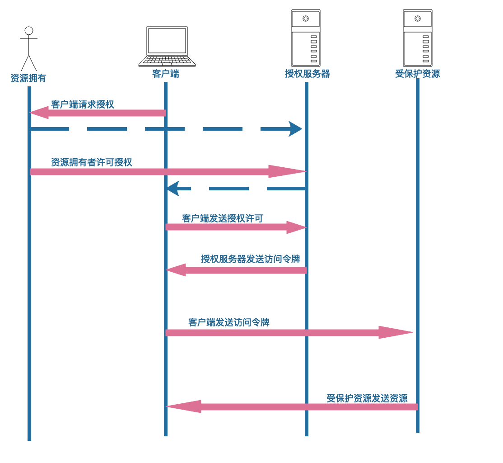

# 简介
OAuth2.0是一个授权协议，它允许软件应用代表（而不是充当）资源拥有者去访问资源拥有者的资源。应用向资源拥有者请求授权，然后获得令牌，并用它来访问资源。

## 协议规范
OAuth2.0框架能让第三方应用以有限的权限访问HTTP服务，可以通过构建资源拥有者与HTTP服务间的许可交互机制，让第三方应用代表资源拥有者访问服务，或者通过授权给第三方应用，让其代表自己访问服务。

## 凭证共享与凭证盗用

### 共享用户凭证
复制用户的凭证并用于登陆另一个服务，客户端直接代表用户访问受保护资源，对于服务是同一个公司下，可以采用这种模式

### 向用户索要凭证
客户端访问受保护资源，可以通过向用户索取用户名密码，客户端可能会保存用户名密码，对于像移动应用端要求用户输入用户名密码访问后端接口。

### 开发者密钥
客户端使用开发者颁布的密钥访问受保护资源，客户端可以通过密钥访问所有用户的受保护资源，一旦密钥被盗所有用户将受到影响

### 用户特殊密码
用户维护除账号密码外的额外密码，用户通过像客户端提供这种特殊密码授权客户端访问权限

## 授权访问
OAuth设计目的是让最终用户通过OAuth将他们在受保护资源上的部分权限委托给客户端应用，使客户端应用代表他们执行操作。为实现这一点，OAuth引入了授权服务器

### 权限委托
委托是OAuth强大功能的根基。OAuth本身并不承载或传递权限，它提供一种方式让客户可以请求用户将部分权限委托给自己，用户可以批准这个委托请求。

### 用户主导的安全
OAuth系统遵循TOFU原则（首次使用时信任），在TOFU模型中，需要用户在第一次运行时进行安全决策，而且并不为安全决策预设任何先决条件或者配置，仅提示用户做出决策，之后系统会记住用户的决策。OAuth实现并不强制要求TOFU方法管理安全策略。

## OAuth2.0优缺点
优点：
- 善于获取用户的委托决策，并通过网络传递出去，让多方参与安全决策过程，尤其是在运行期间让最终用户参与决策
- 让复杂性尽可能从客户端转移到服务端，客户端不需要处理签名规范化以及解析复杂的安全策略、也不需要担心处理复杂的用户凭证
- 授权服务器和受保护资源需要承担更多的复杂性和安全方面的责任。客户端只用保护好自身客户端凭证和用户的令牌即可，单个客户端攻破只会影响该用户，并且不会泄露用户的凭证

缺点：
- OAuth的某些自定义选项可能被用在错误的地方或实施不当，导致不安全的实现
- 一个系统即使按照规范正确的实现OAuth，也不意味着该系统在实践中是安全的

## OAuth2.0不能做什么
- OAuth没有定义HTTP协议之外的情形
- OAuth不是身份认证协议
- OAuth没有定义用户对用户的授权机制
- OAuth没有定义授权处理机制，并不定义授权内容。由服务API定义使用范围、令牌之类的OAuth组件来定义一个给定的令牌适用于那些操作
- OAuth没有定义令牌格式，但颁发令牌的授权服务器和接收令牌的受保护资源仍然需要理解令牌
- OAuth2.0没有定义加密方法
- OAuth2.0不是单体协议