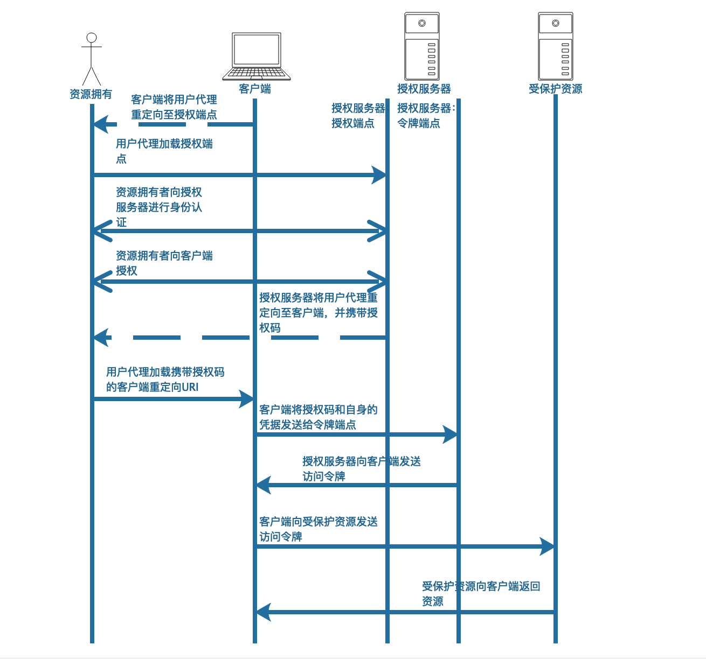

# OAuth组件

## OAuth协议概览
OAuth事务中两个重要步骤是颁发令牌和使用令牌。一个规范的OAuth事务包含以下事件：
- 资源拥有者希望客户端代表他执行一些操作
- 客户端在授权服务器上向资源拥有者请求授权
- 资源拥有者许可客户端的授权请求
- 客户端接收来自授权服务器的令牌
- 客户端向受保护资源出示令牌

## OAuth2.0授权许可完整过程

## OAuth中的角色：客户端、授权服务器、资源拥有者、受保护资源
OAuth客户端：代表资源拥有者访问受保护资源的软件，通过OAuth来获取访问权限。客户端不需要理解令牌

受保护资源：能通过HTTP服务器进行访问，在访问时需要OAuth访问令牌。受保护资源需要验证令牌，并决定是否需要响应以及如何响应请求

资源拥有者：有权将访问权限授权给客户端的主体

OAuth授权服务器：一个HTTP服务器，在OAuth系统中充当中央组件。授权服务器对资源拥有者和客户端进行身份认证，让资源拥有者向客户端授权、为客户端颁发令牌

## OAuth的组件：令牌、权限范围、授权许可

### 访问令牌
令牌由授权服务器发送给客户端，表示客户端已被授予权限。OAuth不定义令牌本身的格式和内容，但他总代表着：客户端请求的访问权限、对客户端授权的资源拥有者、被授予的权限。客户端不需要理解令牌的内容，但授权服务器、受保护资源需要知道令牌的含义

### 权限范围
一组受保护资源的权限。OAuth协议中使用字符串表示权限范围，可以用空格分割的列表将它们合并为一个集合，因此权限范围的值不能包含空格，OAuth不规定权限范围的格式和结构

### 刷新令牌
授权服务器颁发给客户端的令牌，客户端不用关心令牌内容，客户端使用刷新令牌向授权服务器请求新的令牌，而不用用户参与。OAuth2.0提供了让令牌自动过期的选项，但我们需要让用户不在场的情况下仍然可以访问资源。这种方式以一种独立但互补的方式限制了刷行令牌和访问令牌的暴露范围

### 授权许可
授权许可是OAuth协议中的权限获取方法，OAuth客户端用它来访问受保护资源的权限，成功之后客户端会获得一个令牌
